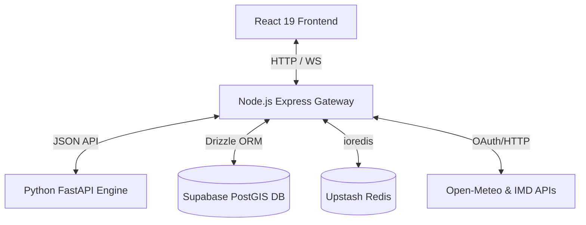

# YatraX Travel Safety Ecosystem 🛰️

YatraX (formerly SafarSathi) is a premium, real-time safety companion application designed to empower tourists in Punjab, India. The platform integrates a mobile-first React dashboard, a resilient Node.js API aggregator, and an unsupervised Python geospatial machine learning engine.

---

## 🏛️ System Architecture

The platform operates on a microservice architecture built for low latency and high uptime:



1. **Frontend Client**: Serves a premium user HUD featuring real-time status-driven safety indicators, Mapbox geofencing, and police markers.
2. **Master Gateway**: Synthesizes safety indexes, manages JWT sessions, serves WebSockets, handles geofences via `turf.js`, and caches high-density routes in Redis.
3. **ML Engine**: Stateless Python FastAPI service. Processes coordinates against Punjab administrative boundaries, LOF environmental anomalies, and unlit nightlight profiles.

---

## 📂 Sub-Projects

Click any of the directories below to view their detailed setups:

- 📱 [**frontend/**](file:///c:/Users/Admin/Desktop/YatraX/frontend/README.md): React 19, Vite 7, TypeScript, TailwindCSS, Mapbox GL JS, Framer Motion.
- ⚙️ [**backend/**](file:///c:/Users/Admin/Desktop/YatraX/backend/README.md): Node.js, Express, Drizzle ORM, Supabase PostgreSQL, Redis, WebSockets, Zod.
- 🛰️ [**punjab/**](file:///c:/Users/Admin/Desktop/YatraX/punjab/README.md): Python 3.10+, FastAPI, GeoPandas, Shapely, PyArrow, Scikit-Learn (LOF).

---

## 🚀 Quick Start Guide

To run the complete ecosystem locally:

### 1. Database Seeding & Setup
Make sure you have your database URL configured in `backend/.env`. Then run:
```bash
cd backend
npm install
npx tsx src/seed-admin.ts
```
*This seeds the admin police officer (`admin@yatrax.dev` / `Admin@1234`) and a test tourist (`tourist@yatrax.dev` / `Tourist@1234`) centered in Jalandhar, Punjab.*

### 2. Run the Python ML Engine
```bash
cd punjab
python -m venv venv
# Windows:
.\venv\Scripts\activate
# macOS/Linux:
source venv/bin/activate
pip install -r requirements.txt
uvicorn api.main:app --port 8000 --reload
```
*FastAPI runs on `http://localhost:8000`.*

### 3. Run the Node.js Backend Gateway
```bash
cd backend
npm run dev
```
*Express runs on `http://localhost:8081`.*

### 4. Run the React Frontend Client
```bash
cd frontend
npm install
npm run dev
```
*Vite serves on `http://localhost:5173`. Proxies `/api` requests directly to `http://localhost:8081`.*

---

## 🧪 Integration Verification
Run the PowerShell integration test suite to verify all 29 endpoint routes:
```powershell
cd backend
powershell ./test-all.ps1
```
All tests should return **`PASSED`**.