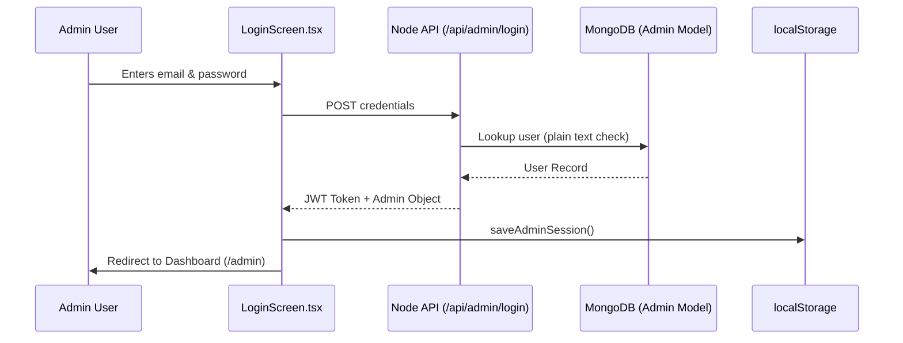
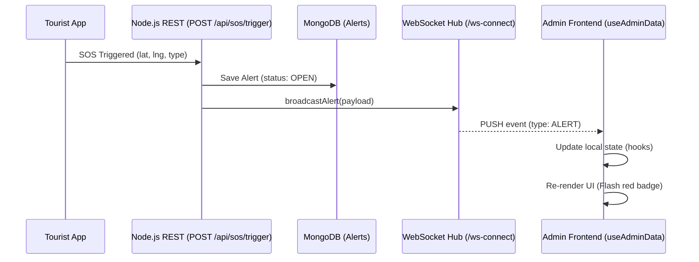

# YatraX Admin System — Comprehensive Context

This document serves as the absolute source of truth for every granular detail regarding the YatraX Admin Console, covering frontend UI flows, colors, SVG icons, React components, and backend Node.js endpoints.

---

## 1. AUTHENTICATION & SECURITY FLOW

### Frontend Entry (`LoginScreen.tsx`)
- **Route:** The admin panel is accessed at `/admin`.
- **UI & Colors:**
  - Background: `bg-gradient-to-br from-slate-900 via-slate-800 to-slate-900`.
  - Glassmorphic card: `bg-white/5 backdrop-blur-xl border border-white/10`.
  - Primary Action Button: `bg-gradient-to-r from-blue-500 to-blue-600`.
- **Icons (`lucide-react`):** `Shield` (Logo), `AlertCircle` (Errors), `Lock` (Sign In button), `Loader2` (Spinning state).
- **Behavior:**
  - Takes `email` and `password`.
  - Currently hits `http://localhost:8081/api/admin/login` directly via `fetch` instead of using the generic API client.
  - On success, it calls `saveAdminSession` (`lib/session.ts`), which drops the JWT token and user info (name, email, departmentCode) into `localStorage` under `safarsathi_admin_session`.

### Backend Controller (`backend-node/src/controllers/adminController.ts`)
- **Endpoint:** `POST /api/admin/login`
- **Logic:** Calls `validateAdminLogin` from `adminService.ts`, which looks up the `admin` Mongoose collection.
- **Vulnerability Note:** Passwords are currently checked in plain text; no bcrypt hashing is implemented for the admin schema.
- **Response:** Returns a standard JWT and an `{ id, name, email, departmentCode, city, district, state }` object.

### Login Flow Diagram



---

## 2. FRONTEND SHELL & LAYOUT (`layout/admin/AdminLayout.tsx`)

The shell wraps all admin routes once authenticated.

### Aesthetics & Top Navigation
- **Base Background:** `bg-slate-50`.
- **Header:** `sticky top-0 bg-white border-slate-200`.
- **Brand Logo:** Dark slate square (`bg-slate-900`) with a white `Shield` icon.
- **Live Status Indicator:** A pulsing emerald dot (`bg-emerald-50 border border-emerald-200 text-emerald-700`) to indicate WebSocket connection.
- **Search Bar:** Centered, `bg-slate-50 border-slate-200`. Uses the `Search` icon.
- **User Dropdown:** Avatar circle with Admin's first initial, displaying their `departmentCode`. Clicking opens a dropdown with `LogOut` (red text).

### Navigation Tabs (Icons from `lucide-react`)
1. **Dashboard** (`LayoutDashboard`)
2. **Alerts** (`Bell`) - Displays a red notification badge (`bg-red-500`) if there are active alerts.
3. **Tourists** (`Users`)
4. **Risk Zones** (`Map`)
5. **Police Units** (`Building2`)

*Note: On mobile, these tabs render horizontally below the header in an `overflow-x-auto` strip.*

---

## 3. MAIN CONTROLLER / ROUTER (`pages/admin/index.tsx`)

Instead of standard URL routing, `index.tsx` acts as a monolithic state machine that renders different "Sections" based on the `activeTab` string.

### State Orchestration
- **Data Hook (`useAdminData`)**: This hook fires immediately upon load, fetching the entire universe of admin data (tourists, alerts, zones, police) via `Promise.all` in one giant network request.
- **Mutation Hooks**: `useAlertActions`, `useZoneActions`, `usePoliceActions`.
- **Dialog States**: Manages the open/close state of every single modal (`ZoneDialog`, `PoliceDialog`, `ConfirmDeleteDialog`, etc.).

### UI Layout & Shell Wireframe
`bg-slate-50` full height container.

```text
+-----------------------------------------------------------------------------------+
| [Shield Icon] SafarSathi Admin  | [Dashboard] [Alerts (3)] [Tourists] [Zones] ... |
|                                 | [Search bar] [Live Pulse] [(A) Admin Name v]    |
+-----------------------------------------------------------------------------------+
|                                                                                   |
|                                                                                   |
|                                                                                   |
|                        ( ACTIVE TAB CONTENT RENDERS HERE )                        |
|                                                                                   |
|                                                                                   |
|                                                                                   |
+-----------------------------------------------------------------------------------+
```

---

## 4. THE 5 MAJOR SECTIONS (TABS)

### A. Dashboard (`DashboardSection.tsx`)
**Goal:** High-level overview of the entire system state.

#### UI Wireframe & Styling
- **Grid Layout:** 8-column stat grid on top (`grid-cols-2 md:grid-cols-4 lg:grid-cols-8`).
- **Cards:** shadcn/ui `<Card>` (`bg-white border rounded-xl`).

```text
[ Active Alerts ] [ Pending ] [ Online Tourists ] [ High Risk ] ... (8 total cards)
  value: 12 (Red)   val: 5      val: 1,432 (Blue)   val: 45

+-----------------------------------------+ +---------------------------------------+
|  Live Map Overview         [Manage Zones| |  Recent Activity          [Broadcast] |
|-----------------------------------------| |---------------------------------------|
|                                         | | * [SOS] Tourist Name       (Critical) |
|      ( Interactive React-Leaflet )      | | * [Warn] High Risk Zone Entered       |
|          Canvas showing all pins        | | * [SOS] Tourist Name                  |
|                                         | |                                       |
+-----------------------------------------+ +---------------------------------------+

+-----------------------------------------+ +---------------------------------------+
|  Recent Alerts               [View All] | |  System Status                        |
|-----------------------------------------| |---------------------------------------|
| (Red Pulse) Medical SOS - John Doe      | |  [API: Online]     [WebSocket: Conn]  |
| (Amber) Connectivity Drop - Jane Smith  | |  [DB: Healthy]     [Sync: Just Now]   |
+-----------------------------------------+ +---------------------------------------+
```

### B. Alerts (`AlertsSection.tsx`)
**Goal:** Triage and resolve SOS triggers.
**UI Elements:**
- Contains a table/list of all alerts. 
- Filters for "ACTIVE", "PENDING", "RESOLVED".
- "Bulk Resolve" button.
- Clicking an alert opens `AlertDetailDialog.tsx`, which brings up the exact latitude/longitude, a mini-map, and the tourist's details. Admin clicks "Resolve" to send the `PATCH /api/admin/alerts/{id}/status` request to the backend.

### C. Tourists (`TouristsSection.tsx`)
**Goal:** Directory of active travelers.

#### UI Wireframe & Styling
- **Header:** Title + Pill Badges (`bg-emerald-50 text-emerald-700` and `bg-red-50 text-red-700`).
- **Table Grid:** `grid-cols-[40px_1fr_120px_100px_140px_120px_100px]`.

```text
[Tourist Management]          [ (Pulse) 1,432 Online ] [ 45 High Risk ] [Broadcast]
-----------------------------------------------------------------------------------
[Search by name...] [Filter: All Tourists v]                            [Export]
-----------------------------------------------------------------------------------
 [ ] | Tourist       | Status | Risk      | Last Seen | Location        | Actions
-----------------------------------------------------------------------------------
 [ ] | John Doe      | Active | High (Red)| 2 min ago | 28.53, 77.39    | [View]
     | (Passport)    |        |           |           |                 |
```

### D. Risk Zones (`ZonesSection.tsx`)
**Goal:** Geospatial hazard management.

#### UI Wireframe & Styling
- **Layout:** Split view. Map occupies `lg:col-span-2`, Zone List occupies `lg:col-span-1`.
- **Floating Action:** When "Add Zone" is clicked, a floating panel (`fixed bottom-6 bg-white shadow-xl`) instructs the admin to click the map.

```text
[Risk Zone Management]                   [ 3 Critical ] [ 15 Active ]
---------------------------------------------------------------------
[Search zones...] [Filter by severity v]                 [+ Add Zone]

+-----------------------------------------+ +-----------------------+
|  Zone Map                               | | Zones (15)  [+ Cancel]|
|-----------------------------------------| |-----------------------|
|                                         | | [ZoneCard]            |
|                                         | | Red Zone Alpha        |
|     ( Interactive Map with drawn        | | Critical - 500m       |
|       red/orange SVG circles )          | | [Edit] [Delete]       |
|                                         | |-----------------------|
|                                         | | [ZoneCard]            |
|                                         | | Market Square         |
+-----------------------------------------+ +-----------------------+
                     [ Floating: Click Map to drop pin ]
```

- **Backend Flow:** Submitting the form hits `POST /api/admin/risk-zones`. Because the `RiskZone.schema.ts` is queried dynamically during tourist score calculation, dropping a zone *instantly* drops the safety score of any tourist in that zone.

### E. Police Units (`PoliceSection.tsx`)
**Goal:** Track static responder units.
**UI Elements:**
- Renders `PoliceCard.tsx` grids. 
- Allows adding outposts, standard stations, or District HQs with contact numbers.
- Deletions trigger `ConfirmDeleteDialog.tsx` before hitting `DELETE /api/admin/police/{id}`.

---

## 5. BACKEND ARCHITECTURE CONTEXT

### Core Controller (`backend-node/src/controllers/adminController.ts`)
- Powers the dashboard data aggregates.
- Endpoint logic is entirely separated from the tourist-facing API.

### Mongoose Schemas Used
1. **`RiskZone.schema.ts`**: `{ zoneId, name, centerLat, centerLng, radiusMeters, riskLevel (LOW/MEDIUM/HIGH), active }`
2. **`PoliceDepartment.schema.ts`**: `{ name, departmentCode, latitude, longitude, contactNumber, type }`
3. **`Alert.schema.ts`**: Mutated when admins shift an alert from `OPEN` to `RESOLVED` or `DISMISSED`.

### Immediate Real-time Sync (WebSockets)
- Governed by `backend-node/src/services/websocketHub.ts`.
- **Flow:** When a tourist fires an SOS (`POST /api/sos/trigger`), the backend pushes an `ALERT` payload across the generic `/topic/alerts` broadcast.
- The Admin's frontend `useAdminData` hook listens to this socket and instantly injects the new alert into the Dashboard's `recentAlerts` list and updates the `activeAlerts` `StatCard` without a page refresh. 

### WebSocket Real-time Flow



---

## 6. NOTABLE TECHNICAL DEBT (As of Current State)
- **Hardcoded Absolute URLs:** The Admin `LoginScreen` hardcodes `http://localhost:8081` rather than using mapped env variables.
- **Monolithic State:** The `AdminPanel` `index.tsx` is over 400 lines and manually handles route swapping via switch-cases rather than utilizing nested React Router functionality.
- **Lack of Authorization Guards:** The frontend relies on checking `localStorage` to hide the panel. A sophisticated user could bypass the frontend check; therefore, robust server-side JWT verification on all `/api/admin/*` endpoints is required (it exists partially via `requireAdmin` but must be strictly enforced).
