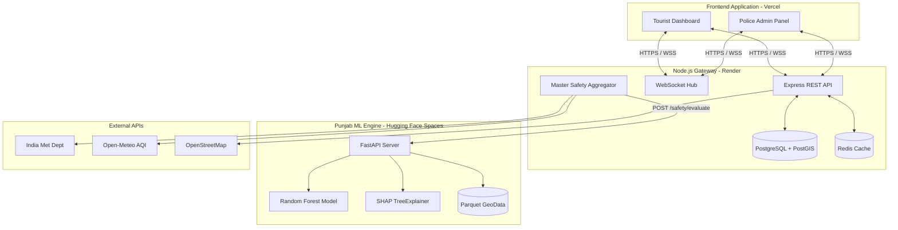

# YatraX — Global Context Document
> This document serves as the high-level architectural overview for the entire YatraX ecosystem. For component-specific details, see the `context.md` files in each respective subdirectory.

---

## 1. Ecosystem Overview

YatraX is a comprehensive AI-powered tourist safety platform designed to provide real-time risk assessment, geofencing, and emergency response capabilities. The system operates through a trio of specialized microservices working in concert:

1. **Frontend (React/Vite)**: The user-facing application for both tourists and police administrators.
2. **Backend (Node.js/Express)**: The central gateway, database manager, and real-time WebSocket hub.
3. **Punjab ML Engine (Python/FastAPI)**: A specialized, stateless geospatial machine learning service that evaluates geographic risk factors.

---

## 2. High-Level Architecture



---

## 3. The Flow of Safety

1. **Location Ingestion**: The frontend periodically sends the tourist's GPS coordinates to the backend.
2. **Geofencing**: The backend (and frontend locally via RBush) checks if the coordinate intersects any active risk zones.
3. **Aggregator Pipeline**: The backend's Master Aggregator requests a baseline geographic risk score from the **Punjab ML Engine**.
4. **Dynamic Context**: The Master Aggregator fetches live data (AQI, Weather warnings, Police/Hospital ETAs) and combines it with the ML baseline. Admin manual penalties are also applied here.
5. **Score Generation**: A final Safety Score (0-100) is generated.
6. **Real-time Broadcast**: If the score drops or a risk zone is entered, the WebSocket hub broadcasts the update instantly to the tourist's screen.

---

## 4. Directory Structure

```text
YatraX/
├── frontend/          # React 19 + TypeScript 5.9 PWA
│   ├── src/pages/user/    # Tourist-facing routes
│   ├── src/pages/admin/   # Police-facing routes
│   └── context.md     # Frontend-specific documentation
│
├── backend/           # Node.js + Express 5 + Drizzle ORM
│   ├── src/modules/       # Feature modules (auth, safety, tourist, alerts)
│   ├── src/shared/        # DB, config, WebSocket, middleware
│   └── context.md     # Backend-specific documentation
│
└── punjab/            # Python 3.10 + FastAPI ML Microservice
    ├── main.py            # API Entrypoint
    ├── *.pkl              # ML Models (LFS tracked)
    ├── data/*.parquet     # Geospatial reference data (LFS tracked)
    └── context.md     # ML Engine documentation
```

---

## 5. Deployment Architecture

| Service | Recommended Hosting | Notes |
|---|---|---|
| **Frontend** | Vercel / Netlify | PWA compatible, static site generation for assets. |
| **Backend** | Render / Railway | Requires persistent connection for WebSockets. `trust proxy` enabled for Express rate-limiting. |
| **ML Engine** | Hugging Face Spaces | Dockerized container. Requires Git LFS for the large `rf_safety_regressor.pkl` model. Port 7860. |
| **Database** | Supabase / Neon | Requires PostGIS extension enabled. |
| **Cache** | Upstash / RedisLabs | Used for high-speed rate limiting and safety score caching. |

---

## 6. Shared Responsibilities

### The "Unified Safety Metric"
To prevent user panic, the backend calculates a `Danger Index` (0-10) which is converted into a `Safety Score` (0-100) before reaching the UI. The ML Engine only deals in abstract hazard weights. The Frontend maps this 0-100 score into visual themes (Emerald, Amber, Crimson).

### Security
- **Authentication**: JWT Bearer tokens issued by the backend.
- **Admin Actions**: Protected by `requireRole('admin')` middleware.
- **Rate Limiting**: Globally applied on the backend (trusting proxy headers from Cloudflare/Render).
